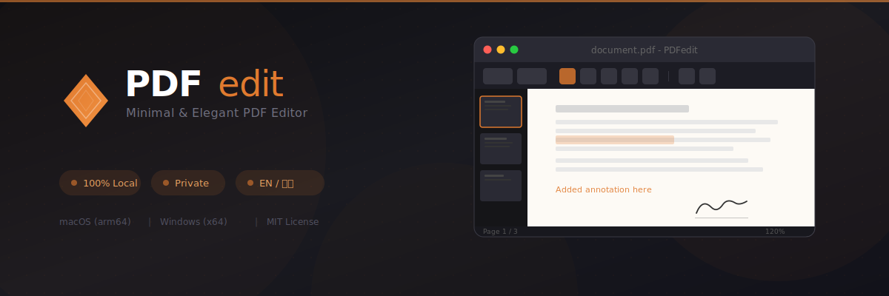

<p align="center">
  
</p>

<h1 align="center">PDFedit</h1>

<p align="center">
  A minimal and elegant PDF editor built with Electron.<br>
  Edit PDFs locally with full privacy — no internet required.<br><br>
  極簡優雅的 PDF 編輯器，完全本地處理，無需網路連線。
</p>

<p align="center">
  
  
  
  
</p>

---

## Features / 功能特色

- **100% Local Processing / 完全本地處理** — Your data never leaves your device. 資料不會上傳至雲端。
- **Light & Dark Theme / 明暗主題** — Auto-detects system theme with manual toggle. 自動偵測系統主題，可手動切換。
- **Bilingual Interface / 雙語介面** — Traditional Chinese (繁體中文) & English.
- **Digital Signatures / 電子簽名** — Draw, upload images, save & manage signatures. 手繪簽名、上傳圖片、儲存管理。
- **Editing Tools / 編輯工具** — Text, images, freehand drawing, shapes (line, rectangle, circle, arrow), highlighter, eraser. 文字、圖片、手繪、形狀、螢光筆、橡皮擦。
- **Page Management / 頁面管理** — Rotate, delete, duplicate, insert blank pages, drag-to-reorder. 旋轉、刪除、複製、插入空白頁、拖放排序。
- **Multi-file Operations / 多檔操作** — Merge and split PDFs. 合併與分割 PDF。
- **Multi-tab Editing / 多分頁編輯** — Edit multiple PDFs simultaneously with independent state. 同時編輯多個 PDF，各分頁狀態獨立。

---

## Supported Platforms / 支援系統

| Platform / 平台 | Architecture / 架構 | File / 檔案 | Minimum Version / 最低版本 |
|---|---|---|---|
| **macOS** | Apple Silicon (arm64) | `.dmg` / `.zip` | macOS 10.15 (Catalina)+ |
| **Windows** | x64 (Intel / AMD) | `.exe` installer | Windows 10+ |

> **Note / 注意**：macOS builds are not code-signed. On first launch, go to **System Preferences > Security & Privacy** to allow the app.
>
> macOS 版本未經程式碼簽署，首次開啟時需至「系統偏好設定 > 安全性與隱私」中手動允許。

---

## Installation / 安裝

### Prerequisites / 前置需求

- **Node.js** 18.0.0+
- **npm** 9.0.0+

### Setup / 設定

```bash
# Clone the repository / 複製專案
git clone https://github.com/yourusername/pdfedit.git
cd pdfedit

# Install dependencies / 安裝依賴
npm install

# Start in development mode / 啟動開發模式
npm start
```

### Build / 建置

```bash
# Build for macOS
npm run build:mac

# Build for Windows (x64)
npm run build:win

# Build for all platforms
npm run build
```

Build outputs are in the `dist/` directory. 建置產物在 `dist/` 目錄中。

---

## Usage Guide / 使用指南

### Opening Files / 開啟檔案
- Click **Open** in the title bar / 點擊標題列的「開啟」
- Drag & drop a PDF file onto the app / 拖放 PDF 檔案至應用程式
- Keyboard shortcut `Cmd/Ctrl + O`

### Editing Tools / 編輯工具

| Tool / 工具 | Description / 說明 |
|---|---|
| Select / 選取 | Select, move, and resize objects / 選取、移動、調整物件大小 |
| Text / 文字 | Add text with font, size, color options / 新增文字，支援字型、大小、顏色 |
| Image / 圖片 | Insert images (PNG, JPG, GIF, WebP) / 插入圖片 |
| Draw / 繪圖 | Freehand, line, rectangle, circle, arrow / 自由繪製、直線、矩形、圓形、箭頭 |
| Highlight / 螢光筆 | Semi-transparent highlighting / 半透明螢光標記 |
| Signature / 簽名 | Draw or upload digital signatures / 手繪或上傳電子簽名 |
| Eraser / 橡皮擦 | Remove annotations / 刪除註釋 |

### Page Management / 頁面管理
- **Rotate / 旋轉** — 90° clockwise or counter-clockwise / 順時針或逆時針旋轉 90°
- **Delete / 刪除** — Remove the current page (minimum 1 page) / 刪除當前頁（至少保留 1 頁）
- **Duplicate / 複製** — Copy the current page / 複製當前頁面
- **Insert Blank / 插入空白頁** — Add a blank page after current / 在當前頁之後插入空白頁
- **Merge / 合併** — Combine multiple PDF files / 合併多個 PDF 檔案
- **Split / 分割** — Extract specific page ranges (e.g., `1-3, 5, 7-10`) / 擷取指定頁面範圍
- **Drag to Reorder / 拖放排序** — Drag thumbnails to rearrange pages / 拖放縮圖重新排序頁面

### Saving / 儲存
- `Cmd/Ctrl + S` — Save / 儲存
- `Cmd/Ctrl + Shift + S` — Save As / 另存新檔

---

## Keyboard Shortcuts / 鍵盤快捷鍵

| Shortcut / 快捷鍵 | Action / 動作 |
|---|---|
| `Cmd/Ctrl + O` | Open file / 開啟檔案 |
| `Cmd/Ctrl + S` | Save / 儲存 |
| `Cmd/Ctrl + Shift + S` | Save As / 另存新檔 |
| `Cmd/Ctrl + W` | Close current tab / 關閉當前分頁 |
| `Cmd/Ctrl + +` | Zoom in / 放大 |
| `Cmd/Ctrl + -` | Zoom out / 縮小 |
| `Cmd/Ctrl + 0` | Fit to width / 適合寬度 |
| `Left Arrow` / `PageUp` | Previous page / 上一頁 |
| `Right Arrow` / `PageDown` | Next page / 下一頁 |
| `Delete` / `Backspace` | Delete selected object / 刪除選取物件 |
| `Escape` | Deselect / Close modal / 取消選取 / 關閉對話框 |

---

## Tech Stack / 技術棧

| Library / 函式庫 | Purpose / 用途 |
|---|---|
| [Electron](https://www.electronjs.org/) | Desktop application framework / 桌面應用框架 |
| [PDF.js](https://mozilla.github.io/pdf.js/) | PDF rendering / PDF 渲染顯示 |
| [pdf-lib](https://pdf-lib.js.org/) | PDF manipulation / PDF 結構操作 |
| [Fabric.js](http://fabricjs.com/) | Canvas annotation layer / 畫布註釋層 |
| [pdf-merger-js](https://github.com/nbesli/pdf-merger-js) | PDF merging / PDF 合併 |

---

## Project Structure / 專案結構

```
PDFedit/
├── main.js                  # Electron main process / 主進程
├── preload.js               # Preload script (IPC bridge) / 預載腳本
├── package.json             # Project config / 專案設定
├── SPEC.md                  # AI-readable spec / AI 可讀規格文件
├── src/
│   ├── index.html           # App entry / 應用程式入口
│   ├── js/
│   │   ├── app.js           # Main controller / 主控制器
│   │   ├── pdf-renderer.js  # PDF rendering (PDF.js) / PDF 渲染
│   │   ├── pdf-editor.js    # PDF editing (pdf-lib) / PDF 編輯
│   │   ├── canvas-layer.js  # Annotation layer (Fabric.js) / 註釋層
│   │   ├── page-manager.js  # Thumbnails & navigation / 縮圖與導覽
│   │   ├── tab-manager.js   # Multi-tab management / 多分頁管理
│   │   ├── signature.js     # Signature system / 簽名系統
│   │   ├── ui-controller.js # UI interactions / UI 互動控制
│   │   ├── theme.js         # Theme management / 主題管理
│   │   └── i18n.js          # Internationalization / 國際化
│   ├── css/
│   │   ├── style.css        # Main styles / 主樣式
│   │   ├── themes.css       # Theme variables / 主題變數
│   │   └── signature.css    # Signature panel / 簽名面板樣式
│   ├── locales/
│   │   ├── zh-TW.json       # Traditional Chinese / 繁體中文
│   │   └── en.json          # English / 英文
│   └── lib/                 # Vendored libraries / 第三方函式庫
│       ├── fabric.min.js
│       ├── pdf-lib.min.js
│       └── pdfjs/
└── assets/
    └── icons/               # App icons / 應用程式圖示
```

---

## AI-Assisted Development / AI 輔助開發

If you plan to use AI tools (such as Claude, ChatGPT, Cursor, etc.) to modify or extend this project, **please have the AI read [`SPEC.md`](SPEC.md) first** before making any changes. This specification document contains the complete architecture, module relationships, data structures, and critical implementation details that will significantly reduce errors caused by AI modifications.

如果您打算使用 AI 工具（如 Claude、ChatGPT、Cursor 等）來修改或擴充本專案，**請先讓 AI 讀取 [`SPEC.md`](SPEC.md)**，再進行任何修改。該規格文件包含完整的架構說明、模組關係、資料結構與關鍵實作細節，能有效降低 AI 修改時產生的錯誤。

**Example prompt / 範例提示詞：**
> Please read the SPEC.md file first to understand the project architecture, then help me [your task].
>
> 請先閱讀 SPEC.md 了解專案架構，然後幫我 [你的需求]。

---

## License / 授權

This project is licensed under the [MIT License](LICENSE).

本專案採用 [MIT 授權條款](LICENSE)。
